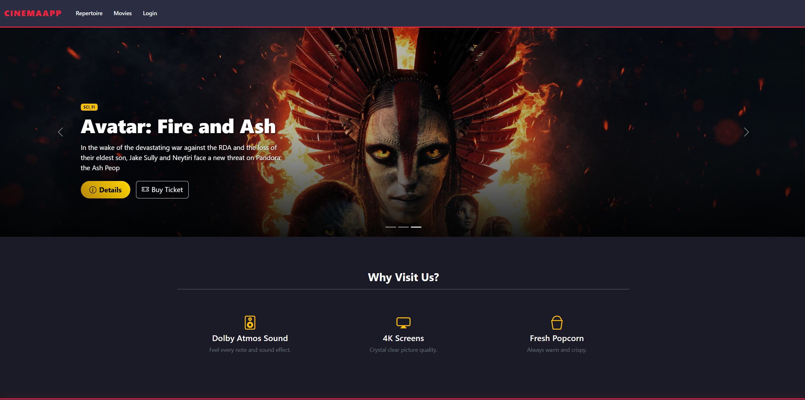
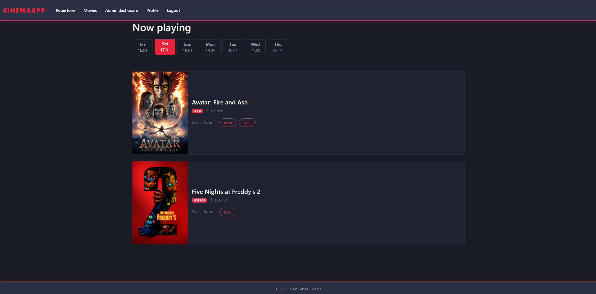
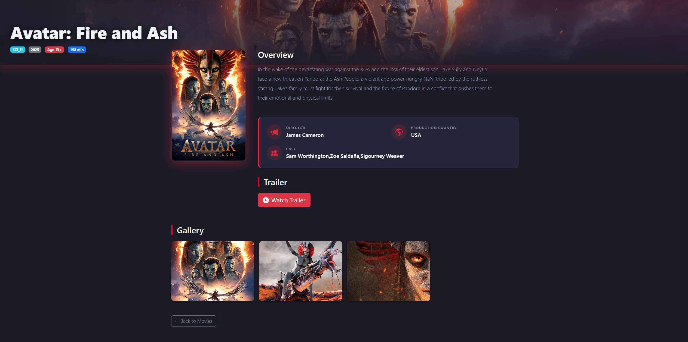
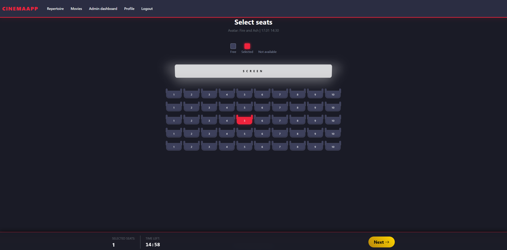
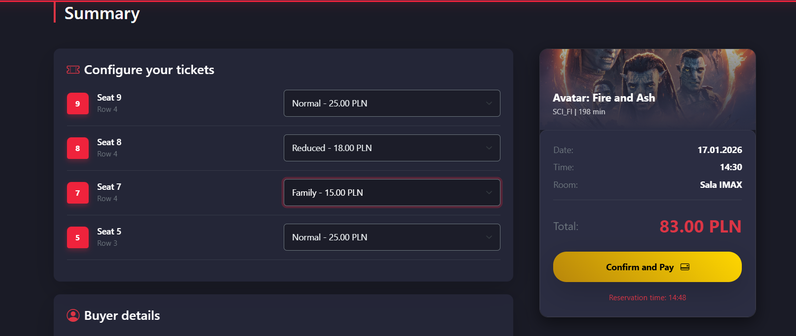
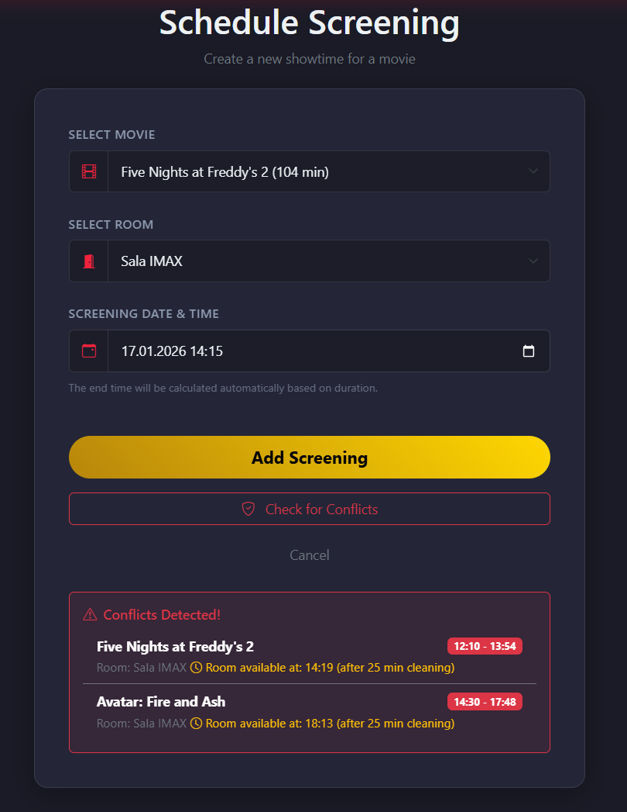
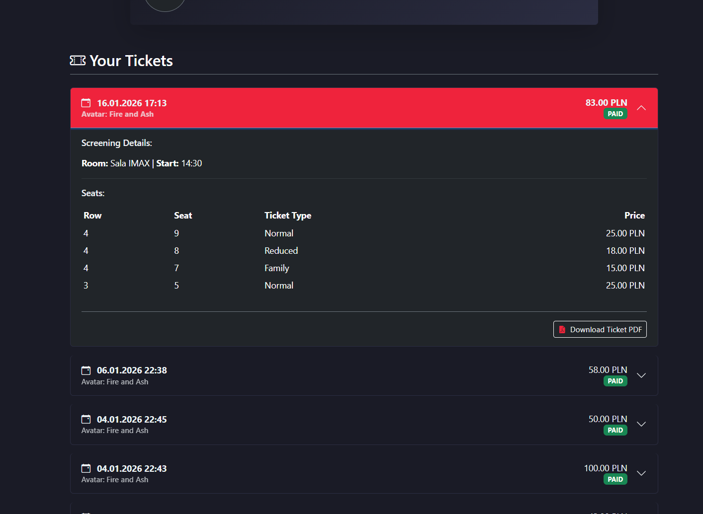
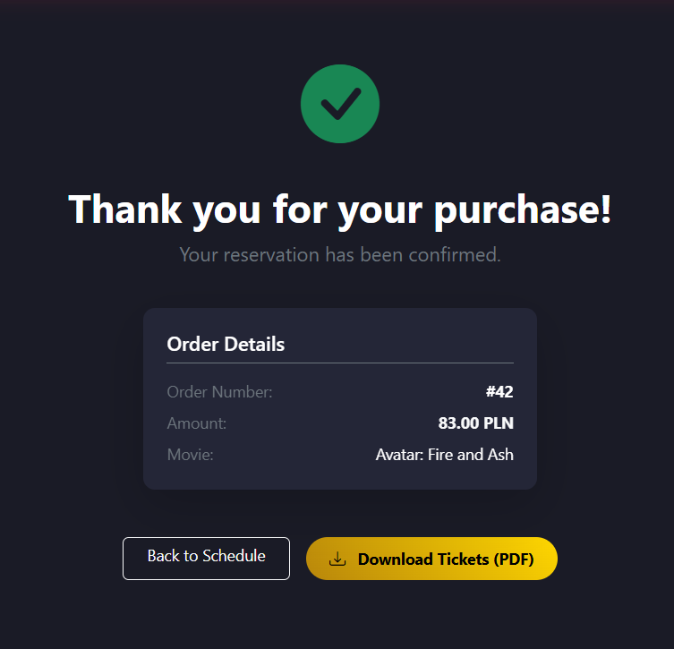
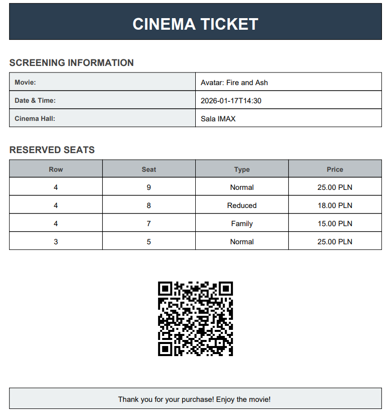

# Cinema Booking Monolith

## Overview

A Spring Boot monolithic application for managing cinema bookings, movie listings, and seat reservations. The system provides both customer-facing and admin functionalities with role-based access control.

## Getting Started

### Prerequisites

- Java 17+
- Maven 3.8+
- PostgreSQL 12+
- Git

### Installation & Running

### Option 1: Docker Compose (Recommended)

1. **Clone the repository**
   ```bash
   git clone https://github.com/JakubPakula1/cinema-booking-monolith.git
   cd cinema-booking-monolith
   ```

2. **Set up environment variables**
   Create `.env` file in the project root (for email notifications):
   ```env
   MAIL_USERNAME=your_email@gmail.com
   MAIL_PASSWORD=your_app_password
   ```

3. **Run with Docker Compose**
   ```bash
   docker-compose up --build
   ```
   - Application will be available at: `http://localhost:8080`
   - PostgreSQL database runs in separate container on port 5432
   - Uploads directory is mounted to `./uploads` on host machine
   - Timezone set to Europe/Warsaw

4. **Stop the application**
   ```bash
   docker-compose down
   ```

5. **View logs**
   ```bash
   docker-compose logs -f app
   ```

### Option 2: Local Development

1. **Clone the repository**
   ```bash
   git clone https://github.com/JakubPakula1/cinema-booking-monolith.git
   cd cinema-booking-monolith
   ```

2. **Configure database**
   - Ensure PostgreSQL is running locally
   - Update `application.properties` or `application.yml` with your database credentials:
     ```properties
     spring.datasource.url=jdbc:postgresql://localhost:5432/cinema_db
     spring.datasource.username=your_username
     spring.datasource.password=your_password
     ```

3. **Build and run**
   ```bash
   mvn clean install
   mvn spring-boot:run
   ```

4. **Access the application**
   - Open browser: `http://localhost:8080`

## Core Features

### Customer Features
- **Movie Repertoire**: Browse available movies with descriptions, ratings, and showtimes
- **Seat Selection**: Interactive seat map for choosing preferred cinema seats
- **Booking Management**: Reserve seats with automatic expiration handling
- **Order Summary**: Review booking details before confirmation
- **Ticket Generation**: Digital tickets with QR codes

### Admin Features
- **Movie Management**: Add, update, and delete movies from catalog
- **Screening Scheduling**: Create and manage movie showtimes
- **Reservation Tracking**: Monitor customer bookings and cancellations

## Key Technical Solutions

### Problem 1: Temporary Reservation Expiration
**Issue**: Reservations needed automatic expiration to prevent seat blocking.

**Solution**: 
- Implemented `TemporaryReservation` entity with expiration timestamps
- `@Transactional` methods automatically refresh expiration time during booking process
- Background cleanup handles expired reservations

### Problem 2: Multipart File Handling in Tests
**Issue**: `NullPointerException` when `MovieFormDTO.getPosterImageFile()` returned null during testing.

**Solution**:
- Added null-safety checks in `AdminMovieViewController`
- Properly configured multipart form data in test requests
- Used `MockMultipartFile` for test file uploads

### Problem 3: Concurrent Seat Reservation Handling
**Issue**: Multiple users could potentially book the same seat simultaneously, causing double-booking conflicts.

**Solution**:
- Implemented `TemporaryReservation` locking mechanism with pessimistic lock
- First user to claim a seat gets immediate reservation while others receive conflict notification
- Database-level constraints prevent duplicate seat reservations
- Automatic reservation expiration frees seats after timeout period (configurable)

## Application Screenshots

### Home Page


### Movie Repertoire


### Movie Details


### Movie Management Form


### Seat Selection


### Booking Summary


### Screening Schedule


### Orders History


### Order Details


### Generated Ticket


## Technology Stack

- **Framework**: Spring Boot 3.x
- **Security**: Spring Security with role-based access (ADMIN, USER)
- **Database**: PostgreSQL with JPA/Hibernate
- **Testing**: JUnit 5, Mockito, Spring Test
- **Build**: Maven
- **Frontend**: HTML5, CSS3, Bootstrap 5
- **Containerization**: Docker & Docker Compose
- **Additional**: Thymeleaf templating, Spring Mail

## Docker Architecture

The application uses multi-stage Docker build for optimized image size:

```
Stage 1 (Build):
- Maven 3.9 with Eclipse Temurin 21 Alpine
- Downloads dependencies
- Compiles and packages the application

Stage 2 (Runtime):
- Eclipse Temurin 21 JRE Alpine
- Minimal image with only runtime dependencies
- Includes timezone support (Europe/Warsaw)
- Creates uploads volume mount point
```

### Services in docker-compose.yml

**App Service:**
- Container name: `cinema-app`
- Port: 8080
- Database connection via internal network to `db` service
- Environment variables for database and email configuration
- Mounted volume for movie uploads persistence

**Database Service:**
- PostgreSQL 15 Alpine
- Container name: `cinema-db`
- Port: 5432
- Persistent volume for data storage
- Pre-configured with cinema_booking database

## Security Features

- **Role-Based Access Control**: 
  - `ADMIN` role for movie and screening management
  - `USER` role for customers
  
- **Concurrent Booking Protection**:
  - Pessimistic locking prevents double-booking
  - Only first user claiming a seat succeeds
  - Others receive conflict notification
  
- **Temporary Reservations**:
  - Seats are automatically released after 15 minutes
  - Prevents seat blocking by inactive users
  
- **Spring Security Integration**:
  - CSRF protection enabled
  - Login/logout functionality
  - Session management

## Build & Deploy

### Development Build
```bash
mvn clean package
java -jar target/cinema-booking-monolith.jar
```

### Docker Build
```bash
# Build the image
docker build -t cinema-booking:latest .

# Run container
docker run -p 8080:8080 \
  -e SPRING_DATASOURCE_URL=jdbc:postgresql://db:5432/cinema_booking \
  cinema-booking:latest
```

### Docker Compose (All-in-One)
```bash
docker-compose up --build      # Start services
docker-compose down            # Stop services
docker-compose logs -f app     # View application logs
docker-compose ps              # Check running containers
```

## Project Structure

```
src/
├── main/
│   ├── java/io/github/jakubpakula1/cinema/
│   │   ├── controller/          # MVC controllers and REST APIs
│   │   ├── service/             # Business logic and transactional operations
│   │   ├── repository/          # Data access layer with custom queries
│   │   ├── model/               # JPA entities
│   │   ├── dto/                 # Data transfer objects
│   │   ├── enums/               # Enumerations (MovieGenre, TicketType, etc.)
│   │   ├── exception/           # Custom business exceptions
│   │   └── security/            # Spring Security configuration
│   └── resources/
│       ├── templates/           # Thymeleaf HTML templates
│       ├── static/              # CSS, JavaScript, images
│       └── application.yml      # Spring configuration
└── test/
    └── java/                    # Unit & integration tests
```

## Environment Configuration

### .env File Example
```env
MAIL_USERNAME=your-email@gmail.com
MAIL_PASSWORD=your-app-specific-password
```

### Application Properties (docker-compose.yml)
```yaml
TZ=Europe/Warsaw                          # Timezone
SPRING_DATASOURCE_URL=...                 # Database connection
SPRING_DATASOURCE_USERNAME=...            # DB username
SPRING_DATASOURCE_PASSWORD=...            # DB password
CINEMA_UPLOAD_DIR=/app/uploads            # File upload directory
MAIL_USERNAME=${MAIL_USERNAME}            # Email service
MAIL_PASSWORD=${MAIL_PASSWORD}            # Email password
```

## Testing

Run tests locally:
```bash
mvn test                                  # Run all tests
mvn test -Dtest=MovieServiceTest         # Run specific test class
mvn test -Dtest=MovieServiceTest#testXXX # Run specific test method
```

Generate test coverage report:
```bash
mvn jacoco:report
# View report at: target/site/jacoco/index.html
```

## Performance Considerations

- **Pagination**: Movie listings use pagination to reduce memory usage
- **Lazy Loading**: Related entities are lazy-loaded where appropriate
- **Database Indexes**: Created on frequently queried fields
- **Connection Pooling**: HikariCP manages database connections efficiently

## License

This project is private and for educational purposes.

